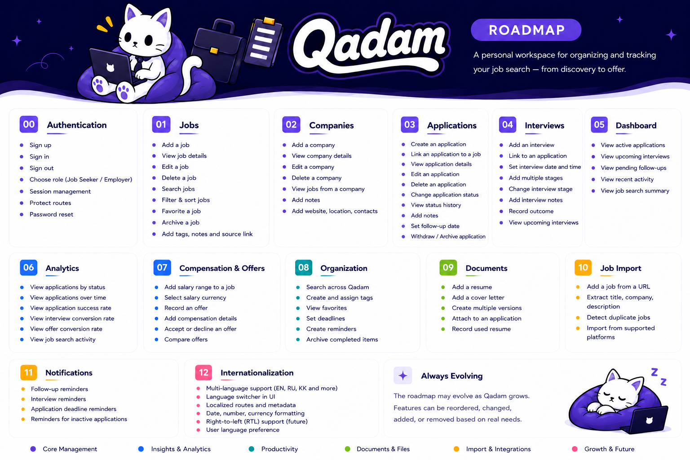

  <picture>
    
  </picture>

## Overview

Qadam is a job search management platform designed to help users discover, organize, and track job opportunities and applications in one place.

## Roadmap

  

## License

This project is licensed under the MIT License - see the [LICENSE](LICENSE) file for details.
